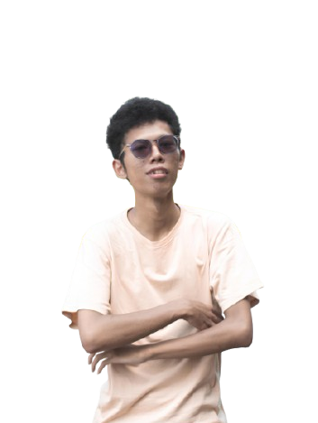

# 🌟 Portfolio Website - Ahmad Ubaidillah Tsani

Portfolio website pribadi yang modern dan responsif, dibangun dengan Vue.js 3 dan Tailwind CSS. Menampilkan projects, skills, certificates, dan informasi kontak dengan desain yang elegan dan interaktif.

## ✨ Features

- 🎨 **Modern Design** - UI/UX yang clean dengan gradient emerald & blue theme
- 📱 **Fully Responsive** - Optimal di semua device (mobile, tablet, desktop)
- ⚡ **Fast Performance** - Built with Vue 3 Composition API
- 🎭 **Smooth Animations** - AOS (Animate On Scroll) integration
- 🌐 **Interactive Sections** - Hero, Services, Skills, Projects, Contact
- 📄 **Downloadable CV** - Direct CV download functionality
- 🔝 **Scroll to Top** - Smooth scroll navigation
- 📧 **Contact Form** - Easy to reach out

## 🛠️ Tech Stack

### Frontend Framework
- **Vue.js 3** - Progressive JavaScript Framework
- **Vite** - Next Generation Frontend Tooling

### Styling
- **Tailwind CSS** - Utility-first CSS framework
- **Custom Gradients** - Emerald to Blue theme
- **Heroicons** - Beautiful hand-crafted SVG icons

### Libraries & Plugins
- **AOS** - Animate On Scroll Library
- **Vue Router** (optional) - For multi-page navigation
- **Font Awesome** - Social media icons

## 📸 Screenshots

### Desktop View

### Mobile View

## 🤝 Contributing

Contributions, issues, dan feature requests sangat diterima!

1. Fork the Project
2. Create your Feature Branch (`git checkout -b feature/AmazingFeature`)
3. Commit your Changes (`git commit -m 'Add some AmazingFeature'`)
4. Push to the Branch (`git push origin feature/AmazingFeature`)
5. Open a Pull Request

## 📄 License

Distributed under the MIT License. See `LICENSE` for more information.

## 👤 Author

**Ahmad Ubaidillah Tsani**

- GitHub: [@Madiennasaa](https://github.com/Madiennasaa)
- LinkedIn: [Ahmad Ubaidillah Tsani](https://www.linkedin.com/in/ahmadubai02)
- Instagram: [@madnst_](https://www.instagram.com/madnst_/)
- Email: ahmadubai02@gmail.com

## 🙏 Acknowledgments

- [Vue.js](https://vuejs.org/)
- [Tailwind CSS](https://tailwindcss.com/)
- [Heroicons](https://heroicons.com/)
- [AOS Library](https://michalsnik.github.io/aos/)
- [Font Awesome](https://fontawesome.com/)

---

⭐️ Jangan lupa kasih star jika project ini membantu Anda!

**Made with ❤️ by Ahmad Ubaidillah Tsani**